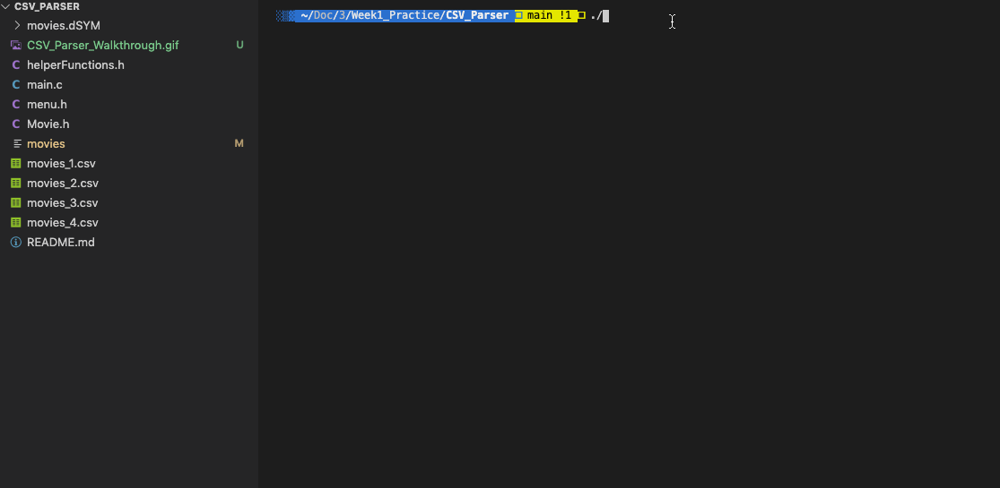

# CSV_Parser
---

Run this command to create an executable named movies:

gcc --std=gnu99 -g -Wall -o movies main.c

The ./movies executable can then be must be called as follows:

./movies

---
## Video Walkthrough

Here's a walkthrough of program:

GIF created with [LiceCap](http://www.cockos.com/licecap/).
